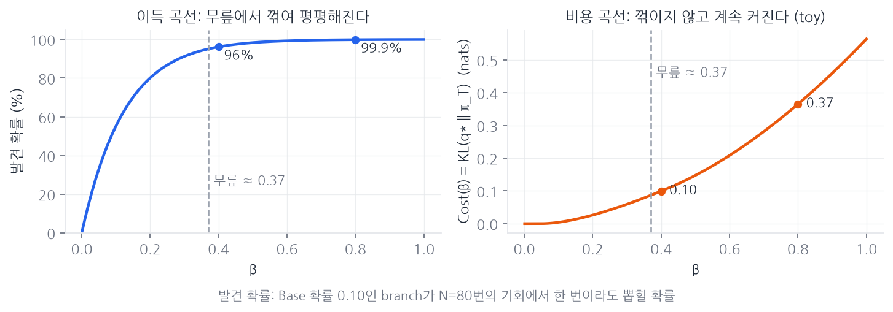
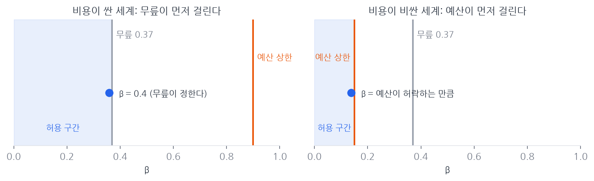
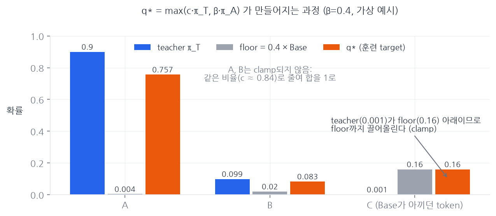
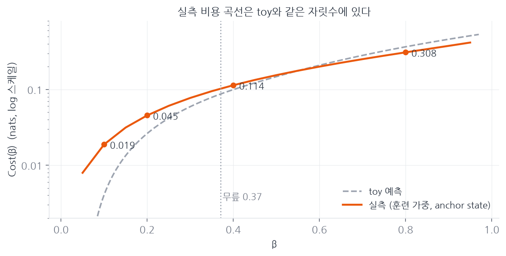
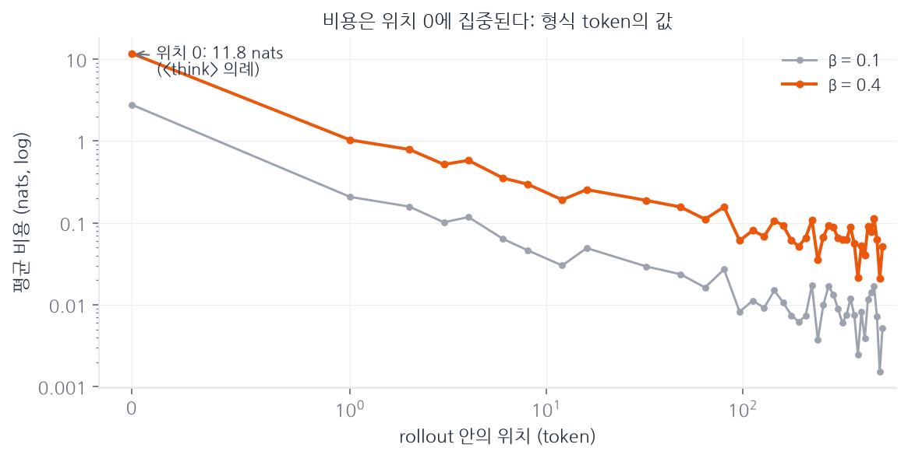
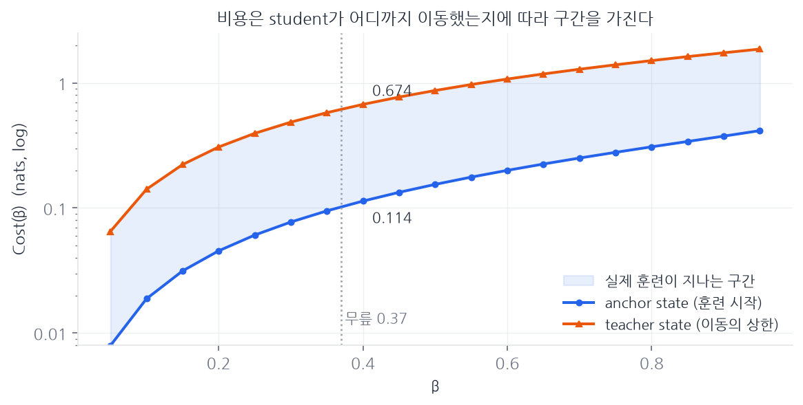
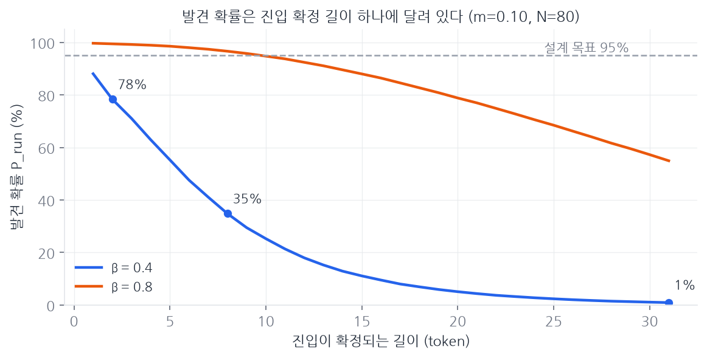

# Cost(β) 사전 분석: 훈련 전에 β를 검증하는 계산

이 문서는 distillation 훈련에 들어가기 전에 가장 먼저 수행하는 계산인 Cost(β) 사전 분석을 다룬다. 왜 이 계산이 필요한지(§1~2), 무엇으로 어떻게 쟀는지(§3), 결과를 읽는 규칙(§4), 실측 결과와 판정(§5~7), 부수 결과와 훈련 전 예보(§8~9), 판정 후 행동(§10)을 정리한다. 설계 결정과 파라미터 유도의 원본은 Experiments.md §1이고, 수치의 출처 스크립트와 원자료는 `Document/PreAnalysis/`에 있다.

전제: student와 anchor는 Qwen3-1.7B-Base 하나다. Base 자체가 frozen pre-distillation anchor(π_A)이며 별도의 cold-start 단계는 두지 않는다. teacher(π_T)는 Qwen3-14B를 thinking mode로 쓴다.

## 1. 이론 배경: β를 몇으로 할 것인가

우리 방법에서 사람이 직접 정해 주어야 하는 값은 β 하나다. β는 floor를 얼마나 강하게 걸지를 정한다. β=0이면 floor가 아예 없으니 보통의 distillation과 같아지고, β=1이면 Base가 주던 확률을 전부 그대로 지키라는 뜻이라 teacher를 거의 따라갈 수 없게 된다. 그 사이 어딘가를 골라야 한다.

이 값을 실험으로 찾을 수도 있다. 여러 β로 훈련을 돌려 보고 제일 잘 되는 값을 고르는 방식이다. 하지만 그러면 훈련을 여러 번 돌려야 해서 오래 걸리고, 그렇게 찾은 값에는 "결국 β는 계산으로 유도할 수 없는 값인가"라는 의문이 남는다. 그래서 우리는 순서를 뒤집는다. β를 먼저 계산으로 유도해 두고, 실험은 그 유도가 맞았는지 확인하는 자리로 쓴다. 이 절이 그 유도 과정이다.

### 1.1 β를 올리면 생기는 일: 좋은 것 하나, 나쁜 것 하나

β를 키우면 두 가지가 함께 커진다.

좋아지는 쪽부터 보자. distillation은 Base가 쓰던 여러 풀이 갈래(branch) 중 일부의 확률을 심하게 깎을 수 있는데, floor는 그 확률이 일정 수준 아래로 떨어지지 않게 막아 준다. 예를 들어 Base가 확률 0.10으로 쓰던 branch라면, floor 덕분에 distillation 이후에도 진입 확률이 최소 β×0.10으로 남는다. β=0.4라면 0.04다.

이렇게 살아남은 확률이 실제로 의미가 있으려면, 이후 RL이 그 branch를 한 번이라도 뽑아 봐야 한다. 한 번이라도 뽑혀야 정답 여부가 확인되고 학습 신호가 생기기 때문이다. RL이 한 문제에서 branch를 뽑아 볼 기회는 두 값의 곱으로 정해진다. G는 GRPO가 한 문제에서 한 번에 생성하는 rollout 수로, 우리 설정에서 16이다. T_eff는 RL 훈련 동안 같은 문제를 다시 만나 새로 rollout을 뽑는 유효 횟수로, 지금은 보수적으로 5라고 잠정해 두었다 (나중에 RL 중간 checkpoint에서 실측해 갱신한다, Experiments.md §1.4). 그러면 기회의 총수는 N = 16×5 = 80번이다.

80번의 기회 동안 그 branch가 적어도 한 번 뽑힐 확률을 이 문서에서는 발견 확률이라고 부르겠다. 계산하면:

    β=0.4 → 진입 확률 0.04 → 발견 확률 1−(1−0.04)^80 ≈ 96%
    β=0.8 → 진입 확률 0.08 → 발견 확률 ≈ 99.9%

나빠지는 쪽도 있다. β를 키울수록 훈련 목표(target) q*가 teacher에서 더 많이 벗어나고, 그만큼 distillation 직후 성능이 깎인다. 이 벗어난 정도를 재는 값이 이 문서의 주인공인 Cost(β)인데, 자세한 정의는 §2에서 다룬다. 간단한 toy 분포로 계산해 보면 β=0.4에서 0.10 nats, 0.8에서 0.37 nats였다 (`toy_sims/beta_design.py`).

문제의 구조는 이렇다. β를 올리면 이득도 늘고 비용도 늘고, 내리면 둘 다 줄어든다. 어느 쪽도 도중에 방향을 바꾸지 않기 때문에, "여기가 딱 좋다"라고 미분으로 찾아낼 수 있는 내부 최적점이 없다.

### 1.2 내부 최적이 없으면 답은 천장 두 개다

내부 최적이 없을 때 합리적인 선택은 이렇다. 더 올려 봤자 소용없어지는 지점, 또는 더 올릴 형편이 안 되는 지점, 둘 중 먼저 오는 곳까지만 올린다.

의사가 진통제 용량을 정하는 방식과 같다. 용량을 올리면 진통 효과는 커지지만 어느 용량부터는 포화한다. 통증이 이미 다 잡혔는데 더 먹는다고 더 안 아파지지 않는다. 한편 부작용은 용량을 올리는 만큼 계속 커지고, 환자가 견딜 수 있는 한도가 있다. 적정 용량은 "효과가 포화하는 용량"과 "부작용 한도에 걸리는 용량" 중 낮은 쪽이다. 두 상한은 나오는 이유가 완전히 달라서 하나로 합칠 수 없고, 각각 따로 알아낸 뒤 낮은 쪽을 따라야 한다. 환자에 따라 어느 쪽이 먼저 걸릴지도 다르다.

β도 마찬가지로 상한이 두 개 나온다. 두 곡선의 모양을 먼저 눈에 담아 두면 이후 논의가 쉽다.

왼쪽(이득)은 100%라는 천장이 있어 무릎에서 꺾이며 평평해지고, 오른쪽(비용)은 천장이 없어 꺾이지 않고 갈수록 가팔라진다. 이 모양 차이가 아래 두 상한의 출발점이다.

### 1.3 상한 1, 무릎: 더 올려 봤자 소용없어지는 지점

이득 곡선(발견 확률)은 100%라는 천장이 있어서 반드시 어딘가에서 꺾인다. 앞의 숫자가 그 꺾임을 보여 준다. β=0.4에서 발견 확률이 이미 96%인데, β를 두 배인 0.8로 올려도 99.9%가 될 뿐이다. 얻는 것은 3.9%p인데 비용(toy 기준)은 0.10에서 0.37 nats로 거의 4배가 된다. 곡선이 평평해지기 시작하는 지점, 즉 무릎을 넘어서면 β를 올리는 것이 손해라는 뜻이다.

무릎의 위치는 공식으로 나온다.

    β_knee = ln(1/(1−c)) / (m·N) = ln20 / (0.10×80) ≈ 0.37

여기서 c는 "발견 확률을 얼마까지 원하는가"이고 관행적인 신뢰수준 95%를 쓴다(ln(1/(1−0.95)) = ln20 ≈ 3). m은 보호를 약속하는 최소 Base 확률로, inherited branch의 자격선과 같은 값인 0.10이다(Experiments.md §1.3). N은 위에서 설명한 80이다. 재료가 전부 이미 정해져 있는 값들이라, 이 상한은 종이와 연필로 계산이 끝나 있다.

단, 이 공식은 branch 진입이 token 하나로 결정된다는 근사 위에 서 있다. 진입 확률이 β×m으로 남는다는 계산은 floor가 진입 경로에서 한 번만 작동한다고 가정한 것이다. 진입이 여러 token에 걸치면 retention은 β^k_bind로 줄어들고(Experiments.md §1.6), 그 실측과 함의는 §7에서 다룬다.

### 1.4 상한 2, 예산: 더 올릴 형편이 안 되는 지점

이 상한을 이해하려면 실험의 핵심 비교 구도를 알아야 한다. 우리 실험의 몸통은 두 갈래(arm)의 비교다.

    Vanilla arm:    Base → 보통의 OPD (floor 없음, teacher를 그대로 따라감) → RL
    Protected arm:  Base → floor를 적용한 OPD (target이 q*) → RL

두 갈래는 student, teacher, 데이터, compute, RL 설정이 전부 같고, distillation 때 floor를 썼는지 딱 하나만 다르다. 논문의 중심 질문 "branch를 보존하면 downstream RL이 좋아지는가"는 결국 이 둘의 RL 이후 성적 비교로 답해진다.

그런데 이 비교가 성립하려면 조건이 하나 필요하다. 두 갈래가 RL에 들어가는 시점의 성능, 즉 distillation 직후 pass@1이 거의 같아야 한다. 우리가 주장하고 싶은 것은 "protected arm이 RL에서 더 잘 큰 이유는 branch를 보존했기 때문"인데, protected arm이 애초에 더 낮은 성능으로 RL에 들어갔다면, RL 이후의 차이가 branch 덕분인지 출발점이 달랐던 탓인지 갈라낼 수 없기 때문이다. 여기서 "거의 같다"의 허용 오차를 δ라고 부른다(matched-distillation protocol에서 상속하는 값이다).

pass@1 차이는 β가 만든다. vanilla arm은 floor가 없으니 β와 무관하게 고정이고, protected arm은 floor만큼 고쳐진 teacher(q*)를 배우므로 고쳐진 만큼 성능이 처진다. 가상의 예를 들면, vanilla가 62%일 때 β가 작으면 61.8%(차이 0.2%p) 정도로 거의 붙어 있지만, β가 크면 58%(차이 4%p)처럼 벌어진다. 이 차이가 δ를 넘는 순간 "같은 출발점"이라는 전제가 깨지고 비교 실험이 무효가 된다.

그러니 β에는 "이 값을 넘으면 pass@1 차이가 δ를 초과한다"는 경계선이 존재한다. 이것이 예산 상한이다. 문제는 이 경계선이 어디 있는지를 미리 알 수 없다는 것이다. 경계선의 위치는 β를 올릴 때 성능이 얼마나 빨리 깎이는가, 즉 비용 곡선의 기울기가 정하는데, 그 기울기는 실제 teacher와 실제 Base의 분포가 얼마나 자주, 얼마나 세게 부딪히는지에 달려 있다. toy 분포에서는 완만했지만 진짜 모델에서도 완만하다는 보장이 없다. 그래서 실측이 필요하고, 그 실측이 바로 이 문서의 사전 분석이다.

### 1.5 두 상한 중 낮은 쪽을 따라야 하는 이유

정리하면 β가 지켜야 할 조건이 두 개다.

    조건 A: β ≤ 무릎.       넘으면 얻는 것 없이 비용만 낸다.
    조건 B: β ≤ 예산 상한.   넘으면 비교 실험이 깨진다.

둘 다 지키려면 β는 두 상한 모두의 아래에 있어야 하고, 그것은 곧 둘 중 낮은 쪽의 아래에 있어야 한다는 뜻이다. 문 두 개를 연달아 통과하려면 낮은 문의 높이에 맞춰야 하는 것과 같다. 높은 문에 맞추면 낮은 문에 부딪힌다. 이것을 한 줄로 쓴 것이 β* = min(β_knee, 예산 상한)이다.

어느 상한이 먼저 걸리는지는 세계에 따라 다르다.

왼쪽은 teacher와 Base가 크게 부딪히지 않아 비용이 싼 세계로, 예산 상한이 멀리 있어 무릎이 먼저 걸린다. 오른쪽은 자주 부딪혀 비용이 비싼 세계로, 예산 상한이 무릎 앞으로 내려와 먼저 걸린다.

현재 상태를 이 그림 위에 놓으면 이렇다. 무릎은 계산이 끝나서 0.37임을 안다. 예산 상한은 toy 분포에서 재 봤을 때 무릎보다 한참 위에 있었다(β=0.4의 비용이 0.10 nats로 쌌다). 그래서 왼쪽 세계라고 보고 canonical β=0.4로 정했다. 남은 질문은 하나다. 진짜 Qwen 모델에서도 우리는 왼쪽 세계에 있는가. 이것을 훈련 전에 확인하는 것이 Cost(β) 사전 분석이고, 왼쪽이 맞으면 β=0.4 확정, 오른쪽이면 예산 상한의 위치까지 β를 내린다.

## 2. 원리: Cost(β)는 훈련 없이 훈련 결과를 예보한다

"훈련을 안 돌리고 어떻게 훈련 결과를 아는가"가 이 분석의 핵심 원리다.

distillation 훈련이 하는 일은 결국 하나, student를 훈련 목표(target)에 가깝게 만드는 것이다. vanilla arm의 target은 teacher 분포 π_T 그 자체이고, protected arm의 target은 floor 규칙만큼 고쳐진 teacher인 q*다. 훈련이 잘 끝나면 student는 자기 target에 가까워져 있다.

여기서 특이한 점은, target 자체는 훈련 전에 이미 완성되어 있다는 것이다. q*는 닫힌 공식 한 줄로 정의된다.

    q*(v) = max(c·π_T(v), β·π_A(v))        (c는 전체 합을 1로 만드는 공통 정규화 상수)

구체적인 예로 보면 이렇게 만들어진다.

C는 teacher가 준 확률(0.001)이 floor(0.16)보다 낮으므로 floor까지 끌어올려지고(clamp), clamp되지 않은 A와 B는 같은 비율 c로 살짝 줄어들어 전체 합이 1이 된다.

이 계산에 필요한 재료는 π_T와 π_A의 확률값뿐이고, 둘 다 얼려 둔 모델의 forward pass 한 번씩이면 나온다. 학습도 gradient도 필요 없다. 훈련은 이 이미 존재하는 과녁을 향해 student를 옮기는 과정일 뿐이다.

그렇다면 "protected student가 vanilla student보다 얼마나 나빠질까"라는 질문은 이렇게 근사할 수 있다.

    vanilla student가 도달할 곳   ≈ π_T
    protected student가 도달할 곳 ≈ q*
    따라서 둘의 차이 ≈ q*와 π_T 사이의 거리 = KL(q*‖π_T) = Cost(β)

건축에 비유하면, 훈련된 student는 지어진 건물이고 target은 설계도다. 건물이 원안에서 얼마나 벗어날지 알고 싶을 때, 완공을 기다리지 않아도 설계도끼리 비교하면 큰 그림이 나온다. 설계도(q*)가 원안(π_T)과 조금만 다르면 건물도 조금만 다를 것이고, 크게 다르면 건물도 크게 다를 것이다. 시공 오차, 즉 최적화가 target에 완벽히 도달하지 못하는 부분만큼의 오차는 있지만, 설계도 단계에서 이미 크게 어긋나 있다면 착공 전에 알 수 있다.

### nats 읽는 법

KL은 자연로그로 계산하므로 단위가 nats다(밑 2로 재면 bit, 1 nat ≈ 1.44 bit). 숫자에 감을 붙이려면 확률 비율로 번역하면 된다. X nats는 확률 비율 e^X에 해당한다.

    0.1 nats → e^0.1 ≈ 1.11배.  target이 뽑는 token이 teacher 눈에
                                평균 11% 덜 그럴듯해 보이는 정도의 미세한 이탈
    0.7 nats → 약 2배.          눈에 띄는 이탈
    2.3 nats → 약 10배.         사실상 다른 분포

state 하나 수준의 감각도 잡아 두자. teacher가 풀이를 시작하는 token들에 0.999를 주고 나머지에 0.001을 주는데, floor가 그 나머지 쪽에 합쳐서 0.16을 요구하는 state라면

    KL(q*‖π_T) ≈ 0.16·ln(0.16/0.001) + 0.84·ln(0.84/0.999) ≈ 0.67 nats

로, floor가 세게 부딪히는 state 하나는 0.7 nats급으로 비싸다. 반대로 Base와 teacher가 대체로 동의해서 floor가 거의 걸리지 않는 state는 0.001 nats 이하로 사실상 공짜다. Cost(β)는 이런 state별 값의 평균이다. 그래서 평균 0.10 nats는 "대부분의 state는 공짜이고 가끔 약하게 걸린다"는 그림을, 평균 0.6 nats는 "충돌하는 state가 흔하다"는 그림을 뜻한다. 스케일 감각으로, LLM의 다음 token 예측 loss가 보통 1~3 nats/token대이니, 그 옆에 놓으면 0.1 nats는 작은 교정이고 1 nats는 학습 신호 전체와 맞먹는 큰 개입이다.

## 3. 실행: 무엇으로 어떻게 쟀는가

재료는 세 가지이고 전부 확정되어 있다.

- frozen Base: Qwen3-1.7B-Base. anchor π_A이자 훈련 시작 시점의 student다.
- teacher: Qwen3-14B, thinking mode. π_T.
- 문제: MATH(Hendrycks) train split에서 subject × level 층화로 뽑은 200문제.

프롬프트는 teacher의 chat template를 두 모델에 똑같이 적용한다. state는 두 모델에 같은 token 시퀀스로 들어가야 KL 비교가 성립하기 때문이다. 두 tokenizer가 200개 프롬프트 전부에서 동일한 token id를 내는 것을 확인했다.

state 표본은 Base 자신의 rollout에서 뽑는다. 원래 알고 싶은 것은 "distillation 중 student가 방문할 state"에서의 비용인데, 그 state들은 훈련 전에는 존재하지 않고, 훈련 시작 시점의 student가 곧 Base이므로 Base의 rollout이 가장 가까운 대리다. 각 문제에서 rollout을 4개씩 생성했다(최대 1024 token, top-p와 top-k 없는 full softmax, temperature 1.0. 이 temperature는 state를 모으기 위한 probe 설정일 뿐이고, Cost(β)는 state가 주어지면 sampler와 무관하게 정의된다). 800개 rollout의 길이 중앙값은 468 token이었고, 그 위에서 4,000개 state를 뽑았다.

| 구분 | 개수 | 위치 |
|---|---|---|
| opening | 200 | 생성 시작 지점, 문제당 1개 |
| early | 600 | 생성 1~12번째 token을 촘촘히 |
| internal | 3,200 | 생성 16~512번째 token을 stride 16으로 |

절차는 세 단계다.

1. 각 state에서 frozen Base와 frozen teacher를 한 번씩 forward pass 해 두 확률분포를 얻는다.
2. 공식으로 q*를 만들고 KL(q*‖π_T)를 계산한다.
3. β별로 집계한다. forward pass는 한 벌이면 충분하고 β를 바꾸는 것은 저장된 숫자 위의 산수이므로, sweep 4개 점만이 아니라 0.05 간격의 곡선 전체를 그린다.

집계에는 훈련 가중 평균을 쓴다. 표본은 opening을 일부러 과대표집했지만, 실제 distillation은 rollout의 모든 token 위치를 한 번씩 지나가고 opening은 rollout당 하나뿐이다. 그래서 각 표본 위치가 대표하는 실제 위치 구간의 크기와 rollout 길이 분포로 가중해서 평균 낸다. §5 이후의 실측값은 전부 이 가중 평균이다.

수치의 출처와 원자료는 `Document/PreAnalysis/`에 있다. 스크립트는 prepare_problems.py, collect_states.py, cost_beta.py, window_retention.py이고, state 표본의 (π_A, π_T, target) 원자료는 outputs/ 아래에 집계 전 상태로 보존되어 있어서(Experiments.md §4.3의 로깅 항목) 임의의 β에 대한 재계산을 훈련 없이 할 수 있다. 전체 규모는 GPU 한 장에서 몇 시간대의 forward pass 계산이었고, 훈련비는 들지 않았다.

## 4. 판독 규칙

결과물은 β에 대한 곡선 하나다. 곡선은 반드시 0에서 시작하고(β=0이면 q*=π_T와 같으므로) 단조 증가하며, 무릎이 없다. §1.2의 그림이 보여 주듯 무릎(포화)은 이득 곡선의 성질이다. 발견 확률에는 100%라는 천장이 있어 어딘가에서 꺾이지만, 비용에는 천장이 없어 β를 올리는 만큼 계속 올라간다. toy에서도 0.004 → 0.026 → 0.10 → 0.37로, 꺾이기는커녕 갈수록 가팔라졌다. 그러니 이 곡선에서 무릎을 찾으려 하면 안 되고, 대신 아래 세 가지를 읽는다.

읽기 전에 한 가지 주의. nats 단위의 고정 문턱은 존재하지 않고, 만들지도 않는다. δ는 pass@1 단위(%p)이고 이 곡선은 nats 단위인데, 둘 사이의 환산표는 훈련을 해 보기 전에는 존재하지 않는다. 따라서 "허용 비용은 몇 nats"라는 문턱을 지금 정하는 것은 근거를 만들 수 없는 새 상수를 도입하는 일이 된다. 판독은 전부 비교로만 한다.

첫째, 자릿수 확인. Cost(0.4)가 toy와 같은 자릿수(0.1 nats대)인지, 한 자릿수 위(1 nats대)인지 본다. 이 곡선에서 나오는 가장 중요한 한 가지 판정이다.

둘째, 예산 상한이 무릎보다 위인지 아래인지. 곡선 모양에서, 비용이 자릿수를 넘어 가팔라지는 구간이 무릎(0.37) 앞에 오는지 뒤에 오는지를 본다. 두 시나리오로 나누면 이렇다(표의 수치는 전부 가상 예시다).

| Cost(β) | β=0.1 | β=0.2 | β=0.4 | β=0.8 |
|---|---|---|---|---|
| 시나리오 A (싼 세계) | 0.004 | 0.026 | 0.10 | 0.37 |
| 시나리오 B (비싼 세계) | 0.08 | 0.20 | 0.60 | 1.5 |

시나리오 A에서는 무릎 이하 구간(β ≤ 0.4)의 비용이 전부 toy 자릿수 안에 있다. 예산 상한이 무릎보다 위에 있다는 뜻이므로 §1.5 그림의 왼쪽 세계이고, 무릎이 걸려서 β=0.4가 그대로 확정된다. 시나리오 B에서는 무릎에 도달하기도 전에 비용이 자릿수를 넘는다. 예산 상한이 무릎 아래에 있다는 뜻이므로 오른쪽 세계이고, β를 내려야 한다. 참고로 "Base의 opening state에 과제 밖 continuation의 확률이 많이 실려 있으면 floor가 비싸진다"는 우려가 맞았다면 곡선은 B처럼 나온다. 그 우려의 판정도 이 표에서 함께 끝난다.

셋째, 예보 기록. 이것은 분석이라기보다 기록 행위다. 비가 온 뒤에 "어제 구름을 보니 비가 올 만했다"라고 말하는 것은 누구나 할 수 있고 아무것도 증명하지 않는다. 가치 있는 것은 비가 오기 전에 적어 둔 예보가 맞는 것이고, 과학에서 사전등록을 하는 이유와 같다. 그래서 훈련 전에 sweep 4개 arm의 예측 비용을 곡선에서 읽어 이 문서에 기록해 둔다. 훈련이 끝나면 각 arm의 실측 pass@1 하락이 나오는데, 예측의 순서와 비율의 모양(어느 arm이 얼마나 더 비싼가)이 실측과 맞는지 대조한다. 이 대조가 Experiments.md §4.2의 무릎 검증이다. 맞았다면 β=0.4의 근거가 "해 보니 좋았다"에서 "미리 계산했고 계산이 맞았다"로 올라선다. 이 대조는 예측이 훈련 전 시점의 기록으로 남아 있어야만 가능하므로, 미리 적어 두는 것 자체가 판독 목록의 한 항목이다.

## 5. 실측 결과: 예산표와 판정

§4의 규칙대로 읽는다. 먼저 예산표다.

| Cost(β), nats | β=0.1 | β=0.2 | β=0.4 | β=0.8 |
|---|---|---|---|---|
| 실측 (훈련 가중) | 0.019 | 0.045 | 0.114 | 0.308 |
| toy 예측 | 0.004 | 0.026 | 0.10 | 0.37 |

첫째 판독, 자릿수. Cost(0.4) = 0.114 nats로 toy의 0.10과 같은 자릿수이고, 사실상 같은 값이다. 감각으로 옮기면 e^0.114 ≈ 1.12배, 즉 훈련이 쫓는 과녁이 teacher에서 token당 평균 12% 벗어나 있는 정도다. 다음 token 예측 loss가 1~3 nats대인 것과 나란히 놓으면 작은 교정이다.

둘째 판독, 상한의 위치. 무릎 이하 구간의 비용이 전부 toy 자릿수 안에 있으므로 §1.5 그림의 왼쪽 세계다. 예산 상한이 무릎보다 위에 있고, 무릎이 먼저 걸린다. 따라서 canonical β=0.4와 sweep 격자 {0.1, 0.2, 0.4, 0.8}를 그대로 확정한다. "Base의 opening에 과제 밖 continuation의 확률이 많이 실려 있으면 floor가 비싸진다"던 우려도 여기서 함께 기각된다. 실제로 rollout 800개를 읽어 보면 97.4%가 정상적인 단계별 풀이 시도였고, 문제문을 이어 쓰거나 다음 연습문제를 만드는 종류의 이탈은 한 건도 없었다.

### 5.1 비용은 어디서 나오는가: 위치 0의 형식 의례

평균 0.114는 매우 불균등한 분포의 평균이다. 위치별로 쪼개면 이렇다.

| β=0.4의 평균 비용 (nats) | opening (위치 0) | early (1~12) | internal (16~512) |
|---|---|---|---|
| | 11.76 | 0.54 | 0.090 |

위치 0 하나가 전체 훈련 가중 비용의 19%를 차지하는데, 방문 위치로는 0.2%뿐이다. 무슨 일인지는 실제 state 하나를 열어 보면 명확하다. 문제를 막 받은 직후, 두 모델의 다음 token 분포는 이렇게 생겼다.

| token | Base π_A | teacher π_T | floor = 0.4·π_A | q* |
|---|---|---|---|---|
| `<think>` | 0.0000002 | 1.00 | ~0 | 0.600 |
| `To` | 0.60 | 5×10⁻¹⁵ | 0.241 | 0.241 |
| `The` | 0.063 | 9×10⁻¹⁵ | 0.025 | 0.025 |
| `Compute` | 0.030 | 1×10⁻¹⁴ | 0.012 | 0.012 |

teacher는 thinking 모델이라 `<think>`에 확률 1.00을 몰아주는 완전한 의례로 응답을 연다. Base는 그 template token을 사실상 모르고, To나 The로 풀이를 바로 시작하려 한다. 겹치는 후보가 하나도 없으니 floor가 Base 쪽 후보 전부를 붙잡고, teacher가 5×10⁻¹⁵을 주려던 To에 0.241을 강제로 남긴다. 이 token 하나가 이 state 비용의 68%를 만들고, state 전체로는 11 nats대가 된다. 위치 0의 비용은 풀이 갈래가 아니라 형식 token의 값이라는 뜻이다.

이 의례에는 정확한 산수가 하나 따라 나온다. teacher가 한 token에 확률 1을 몰고 anchor가 그 token을 무시하면, 나머지 token 전부가 floor에 걸려 floor의 총합인 β만큼이 teacher의 선택에서 빠져나간다. 그래서 q*가 `<think>`에 남기는 확률은 정확히 1−β이고, 실측도 그대로 나왔다.

| β | 0.1 | 0.2 | 0.4 | 0.8 |
|---|---|---|---|---|
| q*(`<think>`) | 0.900 | 0.800 | 0.600 | 0.200 |

이 값은 distill된 student가 `<think>`로 응답을 열 확률의 예측이기도 하다(§9의 예보 2).

같은 관문이 E 사전 분석에서 반대 방향으로 다시 나타난다. 거기서는 외부 소스가 만든 traj를 채점하는데, post-training을 거친 Qwen3-1.7B가 `<think>` 없이 시작하는 텍스트의 첫 token에 −33.42를 준다(Cal_E_Before_train.md §5.4). 여기서는 Base가 template token을 모르는 쪽이고 거기서는 post-training 모델이 그것을 기대하는 쪽이지만, 위치 0의 값이 풀이 갈래가 아니라 형식 token의 값이라는 결론은 같다. 어느 분석에서든 형식 항을 먼저 분리하고 읽어야 한다.

위치 0을 벗어나면 대체로 싸다. internal state의 중앙값은 0.0018 nats로 사실상 공짜이고, 비싼 쪽 1.8%의 state가 internal 비용의 45.6%를 만든다. 비용을 만드는 것은 모델의 불확실성이 아니라 두 모델의 불일치다. 두 모델의 최선호 token이 일치하는 state(전체의 85%)는 평균 0.031인데, 불일치하는 state는 0.424로 14배다.

## 6. 이 비용은 어느 문장 위의 값인가: state 분포의 괄호

§5의 표에는 전제가 하나 숨어 있다. state 표본을 Base의 rollout에서 뽑았다는 것이다. on-policy distillation이 방문하는 state는 그 시점의 student가 만든 문장이고, student는 훈련이 진행되면 target 쪽으로 이동한다. 방문하는 문장도 함께 이동하므로, §5의 값은 훈련 시작 시점의 비용이지 훈련 전체의 비용이 아니다.

그래서 반대쪽 끝도 쟀다. 같은 200문제에서 teacher가 직접 생성한 rollout으로 state 1,500개를 뽑아 같은 계산을 반복했다. student가 teacher의 문체까지 완전히 이동했다고 가정했을 때의 상한이다.

| Cost(β), 훈련 가중 (nats) | β=0.1 | β=0.2 | β=0.4 | β=0.8 |
|---|---|---|---|---|
| anchor state (훈련 시작) | 0.019 | 0.045 | 0.114 | 0.308 |
| teacher state (이동의 상한) | 0.141 | 0.307 | 0.674 | 1.510 |

두 가지를 읽는다.

첫째, 온전성 검사. opening state는 두 측정에서 문자 그대로 같은 state(프롬프트뿐)라서 값도 같아야 하는데, 실제로 11.76과 11.75로 일치한다. 격차는 전부 생성된 구간에서 난다. teacher의 think 문체 텍스트 위에서는 Base가 계속 낯선 처지가 되어, floor가 Base의 확산된 혼란에 걸리기 때문이다.

둘째, 상한도 감당 가능한 크기다. β=0.4의 상한 0.674 nats는 배율로 1.96배이고 여전히 1 nats 아래다. 게다가 이 상한은 도달하기 어려운 값이다. floor의 역할 자체가 student를 anchor 쪽에 일부 붙들어 두는 것이라, student의 state 분포가 순수한 teacher 분포까지 가는 일은 floor가 무력할 때만 생긴다. 실제 훈련의 착지점은 구간 [0.114, 0.674]의 안쪽이며, 어디에 착지했는지는 OPD와 RL의 중간 checkpoint에서 E 궤적 로깅으로 읽는다(이미 계획된 로깅이다, Experiments.md §4.3).

## 7. 창 단위 retention: token의 보장은 branch 진입까지 살아남는가

floor의 보장은 token 하나 단위다. 그런데 branch에 진입한다는 것은 token 하나가 아니라 진입 segment(branch clustering과 같은 32~64 token) 전체를 통과하는 사건이다. token 수준의 보장 β가 창을 통과하며 어떻게 복리되는지 재기 위해, 생성 길이 64 이상인 anchor rollout 772개의 첫 64 token을 두 모델로 위치별 채점했다.

### 7.1 vanilla distillation의 crush는 복리로 일어난다

teacher는 anchor가 실제로 고른 token에 위치당 중앙값 0.30을 준다. anchor 자신은 같은 token에 0.63을 준다. 위치 하나만 보면 절반쯤의 온건한 억압이다. 그런데 이 비율 약 0.48이 31개 위치에서 곱해지면 창 전체로는 10⁻¹⁰이 된다. 어느 한 token도 눈에 띄게 짓눌리지 않으면서 창이 죽는다. hard entry loss는 단일 token의 압살이 아니라 잔잔한 억압의 복리로 생긴다는 것이 실측으로 확인된 셈이다.

### 7.2 retention = β^k_bind 법칙의 실측

여기서 검증하려는 것은 Experiments.md §1.6의 산수 하나다. floor가 창 안의 k개 위치에서 걸린다면 창 전체의 retention은 β^k이어야 한다는 것. token 하나마다 β배씩 남기니 k번 걸리면 β를 k번 곱한 만큼 남는다는 단순한 계산이다.

이것을 두 경로로 따로 구해 맞춰 본다. 한쪽은 창 retention을 실제로 재고 거기서 지수를 역산한다(retention = β^k를 k에 대해 풀면 k = log(retention)/log(β)). 다른 쪽은 창 안에서 floor가 실제로 걸린 위치를 하나하나 세어 k_bind를 얻는다. 산수가 맞다면 두 값이 같아야 한다.

창은 위치 0을 뺀 [1, 32) 구간이고, 값은 772개 창의 중앙값이다.

| β | 창 retention | retention에서 역산한 지수 | 실측 k_bind (binding 위치 수) |
|---|---|---|---|
| 0.1 | 4.3×10⁻⁵ | 4.4 | 3 |
| 0.2 | 5.0×10⁻⁴ | 4.7 | 4 |
| 0.4 | 9.6×10⁻³ | 5.1 | 5 |
| 0.8 | 0.29 | 5.5 | 8 |

retention에서 역산한 지수와 실제로 센 binding 위치 수가 대체로 일치하고, β=0.4에서 가장 정확하다. Experiments.md §1.6의 산수 retention = β^k_bind가 실제 모델 쌍의 실제 시퀀스에서 성립한다는 뜻이다. binding이 아닌 위치들의 순효과가 0에 가깝다는 것도 함께 확인된다. teacher가 동의하는 token에서는 teacher의 더 높은 확신이 정규화 상수 c의 수축을 상쇄하기 때문이다.

binding이 창의 어디에 몰리는지도 쟀다.

    위치 0: 100%    1: 46%    2~3: 29%    4~7: 23%    8~15: 21%    16~63: 17%

위치 0은 mode를 고르는 자리라 항상 걸리고, 그 뒤로는 감쇠하다가 17% 수준의 바닥에 머문다.

### 7.3 남은 미지수 하나: 진입 확정 길이

k_bind가 창 길이를 따라 쌓이므로, 발견 확률은 branch의 정체가 몇 token 만에 확정되는가에 결정적으로 달린다. 본문 §3.6의 규정대로 k_bind에는 진입이 확정되기 전 구간의 binding만 세면 되는데, 그 구간의 길이가 아직 측정되지 않았다. 실측한 binding 프로파일로 시나리오를 계산하면 이렇다. Base 확률 0.10인 branch, β=0.4, N=80 기준이고, retention에는 위치 0의 mode 선택 binding 한 번이 포함되어 있다.

| 진입이 확정되는 길이 | 기대 k_bind | retention | 발견 확률 P_run |
|---|---|---|---|
| 2 token | 0.8 | 0.19 | 78% |
| 4 token | 1.3 | 0.12 | 63% |
| 8 token | 2.2 | 0.053 | 35% |
| 16 token | 3.8 | 0.013 | 9.5% |
| 31 token | 6.4 | 0.0012 | 0.9% |

78%와 0.9% 사이 어디인지가 이 하나의 길이에 달렸다. 진입 확정 길이는 branch clustering의 성질이므로 branch-dev에서 측정하며, panel 구축의 첫 산출물로 둔다. 값이 나오면 무릎을 β^k로 재계산한다. 그때까지 §1.3의 무릎 0.37은 진입이 token 하나로 결정된다는 근사의 값이다. sweep 격자가 이 불확실성을 괄호친다. 진입이 길게 확정되는 세계라면 β=0.8 arm이 살아 있는 유일한 보호이고, 그 경우 무릎 너머 arm의 성적이 이 산수의 검증대가 된다.

주의할 점 하나. 이 절의 수치는 전부 문자열(정확한 token 시퀀스) 확률 기준이라 하한이다. branch는 표현이 다른 여러 continuation의 묶음이므로 실제 mode 수준의 retention은 이보다 후하다. 확정 판정은 panel의 cluster 질량으로 한다.

## 8. 부수 결과 세 가지

첫째, floor에는 teacher 쪽 보장도 내장되어 있다. max(a,b) ≤ a+b에서

    1 = Σ max(c·π_T, β·π_A) ≤ c + β,    따라서 c ≥ 1−β

이고 q*(v) ≥ c·π_T(v)이므로, 모든 state의 모든 token에서

    q*(v) ≥ (1−β)·π_T(v)

가 성립한다. teacher는 어디에서도 자기 확률의 1−β배 아래로 깎이지 않는다. §5.1의 format 유지율 0.600은 이 하한이 등호로 달성된 사례다(실측 정규화 상수 c = 0.6000).

둘째, arithmetic mixture와의 관계. anchor의 창 위에서 q*와 mixture (1−β)π_T + β·π_A는 사실상 같은 target이다(위치별 KL의 중앙값 0.0004). 둘의 차이는 teacher 문체의 state에 산다. 그런 state에서 q*는 teacher의 token을 평균 0.906으로 유지하지만, mixture는 어디서나 1−β = 0.6으로 깎는다. 위치당 0.91 대 0.6의 격차는 긴 think 궤적에서 복리로 벌어지므로, mixture baseline arm(Experiments.md §2)과의 비교가 갈리는 지점이 바로 여기다.

셋째, think 궤적 위에서 floor의 누수는 작고 몰려 있다. teacher 궤적의 각 위치에서 floor 위에 얹히는 질량(q*에서 샘플링할 때 teacher의 token을 이탈할 확률)은 β=0.4 기준 평균 9.4%, 중앙값 1.2%다. 대부분의 위치에서는 거의 새지 않고, 질량의 30% 이상이 걸리는 위치가 14%로, 문체 전환 지점 소수에 몰려 있다.

## 9. 훈련 전 예보 대장

§4의 셋째 규칙이 요구하는 기록이다. 아래 예측은 전부 훈련 전에 적혔고, 각각 어디서 검증되는지를 함께 적는다.

1. sweep 4개 arm의 handoff 비용은 0.019, 0.045, 0.114, 0.308 nats의 순서와 비율을 따른다. 각 arm의 실측 pass@1 하락의 순서·모양과 대조한다. (sweep handoff 측정, Experiments.md §4.2의 무릎 검증)
2. β=0.4로 distill된 student가 `<think>`로 응답을 여는 비율은 0.60이다(일반식 1−β). checkpoint에서 즉시 확인된다.
3. 실제 훈련의 훈련 가중 비용은 구간 [0.114, 0.674] 안에 착지한다. OPD 로그와 중간 checkpoint에서 확인한다.
4. mixture arm(α=0.4)은 anchor mode의 보존에서는 projection과 비슷하고, think-mode 충실도와 handoff pass@1에서는 뚜렷이 처진다.
5. protected arm의 branch 진입 회복은 retention = β^k_bind를 따른다. panel의 E 측정에서 확인한다.

## 10. 판정 후 행동과 역할 분담

판정은 §5에서 났다. 자릿수는 toy와 같고 무릎이 먼저 걸린다. β=0.4와 sweep 격자를 확정하고 distillation run에 들어갈 수 있다. 착공 전에 남은 측정은 §7.3의 진입 확정 길이 하나이며, branch-dev(panel 구축)의 첫 산출물로 둔다.

확정 판정은 여전히 훈련 실측의 몫이라는 점은 분명히 해 둔다. "protected arm의 pass@1이 vanilla arm보다 δ 이상 처지는가"의 최종 답은 두 arm을 실제로 distillation해야 나온다. pass@1은 훈련된 student의 성질이기 때문이다. 다만 그 실험은 새로 추가하는 것이 아니라 이미 계획의 몸통이다. Experiments.md §2의 주 비교(실험 1)와 β sweep(실험 2)이 정확히 Base에서 시작해 두 방식의 OPD를 적용하는 실험이고, 각 arm의 handoff pass@1이 거기서 측정된다.

두 계기의 역할 분담은 다음과 같다.

| | Cost(β) 사전 분석 | pass@1 실측 |
|---|---|---|
| 재는 대상 | 과녁(target)의 이탈 | 훈련된 student의 이탈 |
| 필요한 것 | frozen 모델 forward pass | distillation 훈련 전체 |
| 층위 | 분석(사전) | 실험(훈련), Experiments.md §2 |
| 답의 성격 | 자릿수 예보 (싼가 비싼가) | 확정 판정 (δ 이내인가) |

사전 분석의 존재 이유는 실측을 대체하는 것이 아니라 순서에 있다. 예보가 toy처럼 싸다고 나오면 안심하고 착공하고, 비싸다고 나오면 착공 전에 멈춘다. 이것이 훈련 없이 가능한 이유는 student가 아니라 과녁을 재기 때문이고, 과녁은 공식이라 훈련 전에 이미 완성되어 있기 때문이다. 훈련이 끝난 뒤에는 예보와 실측의 대조가 설계의 신뢰성을 보여 주는 결과를 하나 더 만들어 준다.
